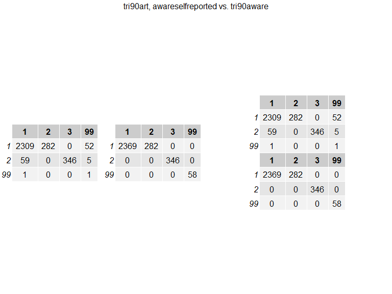

phia\_lca\_jsg2145
================
Jared Garfinkel
8/2/2020

``` r
# Read public-release datasets
#Biomarker dataset
biomarker <- read_csv(file = "./data/Shims22016adultbio.csv",
                      col_names = TRUE, 
                      col_types = NULL,
                      locale = default_locale(), 
                      na = c("", "NA"), 
                      quoted_na = TRUE,
                      quote = "\"", 
                      comment = "", 
                      trim_ws = TRUE, 
                      skip = 0,
                      n_max = Inf, 
                      progress = show_progress(), 
                      skip_empty_rows = TRUE)

#Individual interview dataset
individual <- read_csv(file = "./data/Shims22016adultind.csv",
                       col_names = TRUE, 
                       col_types = NULL,
                       locale = default_locale(), 
                       na = c("", "NA"), 
                       quoted_na = TRUE,
                       quote = "\"", 
                       comment = "", 
                       trim_ws = TRUE, 
                       skip = 0,
                       n_max = Inf, 
                       progress = show_progress(), 
                       skip_empty_rows = TRUE)
```

``` r
ind_dat <-
  filter(individual, bt_status == 1) %>% #
  select(personid, 
         gender, 
         age, 
         hivstatusfinal, 
         known_hiv_status, 
         arvscurrent) %>% 
  mutate(gender = factor(gender, 
                         labels = c("1" = "male",
                                    "2" = "female")),
         across(.funs = as_factor))

bio_dat <- biomarker %>% 
  filter(hiv1statusfinalsurvey == 1) %>%
  select(personid, 
         hiv1statusfinalsurvey,
         aware,
         art,
         awareselfreported, 
         arvstatus, 
         artselfreported, 
         resultvlc, 
         vls, 
         tri90, 
         tri90aware, 
         tri90art, 
         tri90vls) %>%
  mutate(resultvlc = recode(resultvlc, 
                    "< LLOD" = "1",
                    "< LLOQ: 20" = "20",
                    "< LLOQ: 40" = "40",
                    "< LLOQ: 400" = "400",
                    "< LLOQ: 839" = "839",
                    "> ULOQ 10000000" = "10000000"),
         resultvlc = as.numeric(resultvlc),
         vlunder200 = if_else(resultvlc < 200, 1, 2),
         across(.funs = as_factor))
```

``` r
bio_dat_lca = bio_dat %>% 
  select(aware,
         art,
         awareselfreported, 
         arvstatus, 
         artselfreported, 
         vls, 
         tri90, 
         tri90aware, 
         tri90art, 
         tri90vls,
         vlunder200) %>% 
  mutate(aware = recode(aware, "1" = "0", "2" = "1", "99" = NULL),
         art = recode(art, "1" = "0", "2" = "1", "99" = NULL),
         awareselfreported = recode(awareselfreported, "1" = "0", "2" = "1", "99" = NULL),
         arvstatus = recode(arvstatus, "1" = "0", "2" = "1", "99" = NULL),
         artselfreported = recode(artselfreported, "1" = "0", "2" = "1", "99" = NULL),
         vls = recode(vls, "1" = "0", "2" = "1", "99" = NULL),
         tri90 = recode(tri90, "1" = "0", "2" = "1", "99" = NULL),
         tri90aware = recode(tri90aware, "1" = "0", "2" = "1", "99" = NULL),
         tri90art = recode(tri90art, "1" = "0", "2" = "1", "99" = NULL),
         tri90vls = recode(tri90vls, "1" = "0", "2" = "1", "99" = NULL),
         vlunder200 = recode(vlunder200, "1" = "0", "2" = "1", "99" = NULL))
```

``` r
# aware:                1 - Aware or considered aware because ARVs detectable 
#                       2 - Unaware and ARVs not detectable, or unaware and ARV testing results missing 
#                       99 - Missing
#
# art:                  1 - ARVs detectable, self-reported on ART, or both ARVs detectable and self-reported on ART 
#                       2 - Unaware or aware, ARVs not detectable and self-reported not on ART, or aware, missing ARV testing data and self-reported not on ART 
#                       99 - Missing
# awareselfreported:    1 - Self-report aware of HIV + status 
#                       2 - Self-report not aware of HIV + status 
#                       99 - missing
# artselfreported:      1 - On ART 
#                       2 - Not on ART 
#                       99 - Missing
# awareartselfreported: 1 - Self-report as not previously diagnosed 
#                       2 - Self-report as previously diagnosed, not on ART 
#                       3 - Previously diagnosed, on ART 
#                       99 - Missing, including incomplete tri90 information
# arvstatus:            1 - ARV detected 
#                       2 - ARV not detected 
#                       99 - Missing
# resultvlc:            > ULOQ 10000000 - Upper limit of quantification 10000000
#                       < LLOD - less than lower limit of detection 
#                       < LLOQ: 839 - less than lower limit of quantification of 839 
#                       < LLOQ: 400 - less than lower limit of quantification of 400
#                       < LLOQ: 40 - less than lower limit of quantification of 40 
#                       < LLOQ: 20 - less than lower limit of quantification of 20
# hivselfreport:        1 - Self-reported positive 
#                       2 - Self-reported negative 
#                       3 - Self-reported never tested or never received test result 
#                       99 - Missing
```

## First 90 (awareness)

### pre-processed data

``` r
# This table shows the respondents/informants who reported that they were aware of their hiv status or had an identifiable arv drug in their blood test and had an art identified by a blood test
tbl1 = xtabs(~ awareselfreported + tri90art, data = bio_dat)

# This contingency table shows the respondents/informants who reported that they were aware of their hiv status or had an identifiable arv drug in their blood test and the status of a dummy variable that measures whether they have suppressed viral loads
tbl2 = xtabs(~ awareselfreported + arvstatus, data = bio_dat)

# This contingency table shows the respondents/informants who reported that they were aware of their hiv status or had an identifiable arv drug in their blood test and reported that they were taking ART.
tbl3 = xtabs(~ awareselfreported + artselfreported, data = bio_dat)

# This contingency table shows the respondents/informants who reported that they were aware of their hiv status or had an identifiable arv drug in their blood test and the pre-processed self-reported awareness of their HIV status
tbl4 = xtabs(~ tri90aware + awareselfreported, data = bio_dat)
```

``` r
# Grand total
nrow(bio_dat) # 3,055
```

    ## [1] 3055

``` r
# This table shows the respondents/informants who reported that they were aware of their hiv status or had an identifiable arv drug in their blood test and had an art identified by a blood test
tbl1_tri90 = xtabs(~ tri90aware + tri90art, data = bio_dat)

# This contingency table shows the respondents/informants who reported that they were aware of their hiv status or had an identifiable arv drug in their blood test and the status of a dummy variable that measures whether they have suppressed viral loads
tbl2_tri90 = xtabs(~ tri90aware + arvstatus, data = bio_dat)

# This contingency table shows the respondents/informants who reported that they were aware of their hiv status or had an identifiable arv drug in their blood test and reported that they were taking ART.
tbl3_tri90 = xtabs(~ tri90aware + artselfreported, data = bio_dat)

# This contingency table shows the respondents/informants who reported that they were aware of their hiv status or had an identifiable arv drug in their blood test and the pre-processed self-reported awareness of their HIV status
tbl4_tri90 = xtabs(~ tri90aware + awareselfreported, data = bio_dat)

# This table shows the respondents processed tri90aware status and their viral load suppression (under 200 copies/milliliter)
xtabs(~ tri90aware + vlunder200, data = bio_dat)
```

    ##           vlunder200
    ## tri90aware    1    2
    ##         1  2105  546
    ##         2    16  330
    ##         99   44   14

### tri90art

This combined chart shows the contingency table of awareselfreported
vs. tri90art along with tri90aware vs. tri90art. While there are
missing values in awareselfreported, there are none in tri90aware. The
57 missing values from tri90art were classified as missing for
tri90aware data. The 60 respondents who were on art were reclassified as
tri90aware.

``` r
g1 <- tableGrob(tbl1)
g2 <- tableGrob(tbl1_tri90)

haligned <- gtable_combine(g1,g2, along=1)
valigned <- gtable_combine(g1,g2, along=2)
grid.arrange(haligned, valigned, ncol=2, top = "tri90art, awareselfreported vs. tri90aware")
```



### arvstatus

This chart shows contingency tables for awareselfreported alongside
those for tri90aware with respect to arvstatus. As before, those with
detectable arvs in their blood sample were reclassified as tri90aware
regardless of selfreported aware status. Those missing arvstatus data
appear to have been treated or classified differently. 3 respondents
with missing arvstatus data were classified as tri90aware compared to 50
self-reported aware who were missing arvstatus data. Meanwhile, there
was 1 respondent missing arvstatus classified as not tri90aware compared
to 6 of those who reported that they were unaware and had missing
arvstatus data. Although 52 respondents with missing arvstatus data were
considered null under tri90aware, none who were missing
awareselfreported data were also missing arvstatus data. Finally, it
appears that 6 respondents who had no detectable arvs were considered
missing tri90aware data, even though only 1 who had no detectable arvs
were missing awareselfreported data. So, overall the biggest change was
between those missing arvstatus data who said they were aware, most of
whom it appears were reclassified as missing data in tri90aware. 50/3055
= 1.6%. This would effectively reduce the prevalence of awareness by
removing about 50 individuals from the analysis.

#### Why were subjects removed from the analysis?

Generally an observation was removed if they had incomplete tri90 data,
including blood-test data. Specifically, observations to be excluded in
the 90 90 90 analysis with ARV data due to incomplete data defined as:
aware missing and ARV data missing, aware and both ARV and self-reported
ART data missing, or ARVs detectable / self-reported on ART and VLS
missing.

``` r
h1 <- tableGrob(tbl2)
h2 <- tableGrob(tbl2_tri90)

haligned <- gtable_combine(h1,h2, along=1)
valigned <- gtable_combine(h1,h2, along=2)
grid.arrange(haligned, valigned, ncol=2, top = "arvstatus")
```


## artselfreported

44 respondents were removed from the aware group if they reported that
they were aware and on art. 3 respondents were removed from the aware
group if they were awareselfreported and had no detectable arvs. 64
respondents who reported that they were unaware were reclassified. Of
those reclassified, it appears that 55 of them were classified as aware
and 9 were classified as missing data and not included in the tri90
analysis. So, as about 50 respondents were reclassified as aware from
artselfreported data, almost 50 respondents were removed from the tri90
analysis who had previously been considered aware. This is a
differential misclassification and deserves further study.

``` r
j1 <- tableGrob(tbl3)
j2 <- tableGrob(tbl3_tri90)

haligned <- gtable_combine(j1,j2, along=1)
valigned <- gtable_combine(j1,j2, along=2)
grid.arrange(haligned, valigned, ncol=2, top = "artselfreported")
```


## awareselfreported

### tri90 (processed) data

``` r
bio_cong_dat = biomarker %>% 
  filter(tri90 == 1) %>% 
  select(personid, 
         hiv1statusfinalsurvey,
         aware,
         art,
         awareselfreported, 
         arvstatus, 
         artselfreported, 
         resultvlc, 
         vls, 
         tri90, 
         tri90aware, 
         tri90art, 
         tri90vls) %>%
  mutate(resultvlc = recode(resultvlc, 
                    "< LLOD" = "1",
                    "< LLOQ: 20" = "20",
                    "< LLOQ: 40" = "40",
                    "< LLOQ: 400" = "400",
                    "< LLOQ: 839" = "839",
                    "> ULOQ 10000000" = "10000000"),
         resultvlc = as.numeric(resultvlc),
         vlunder200 = if_else(resultvlc < 200, 1, 2),
         across(.funs = as_factor))
```

``` r
# Grand total
nrow(bio_cong_dat)
```

    ## [1] 2997

``` r
# while all the respondents classified as unaware under tri90aware were unaware under awareselfreported, 59 respondents who self-reported they were unaware were reclassified as aware, and 1 respondent classified as missing data was reclassified as aware under tri90aware. A total of 60 respondents were reclassified from their self-reported aware status.
xtabs(~tri90aware + awareselfreported, bio_cong_dat)
```

    ##           awareselfreported
    ## tri90aware    1    2   99
    ##          1 2591   59    1
    ##          2    0  346    0

``` r
# While no respondents classified as unaware under tri90aware were asked for artselfreported data, 306 of those who reported they were not on art were reclassified as aware and 64 respondents with missing artselfreported data were reclassified as aware
xtabs(~tri90aware + artselfreported, bio_cong_dat)
```

    ##           artselfreported
    ## tri90aware    1    2   99
    ##          1 2281  306   64
    ##          2    0    0  346

``` r
# While no respondents who tested positive for art were classified as aware, 282 respondents who tested negative for art were reclassified as aware, and 346 respondents who tested negative for art were classified as unaware.
xtabs(~ tri90aware + tri90art, data = bio_cong_dat)
```

    ##           tri90art
    ## tri90aware    1    2    3
    ##          1 2369  282    0
    ##          2    0    0  346

``` r
# There were 546 respondents with viral load above 200 who were classified as aware. This may be indicative of treatment non-compliance. There were 96 respondents with viral load under 200 classified as unaware. This may indicate the presence of elite suppressors or transient viral load suppression among respondents.
xtabs(~tri90aware + vlunder200, bio_cong_dat)
```

    ##           vlunder200
    ## tri90aware    1    2
    ##          1 2105  546
    ##          2   16  330

``` r
# There were 369 respondents with no detectable arvs reclassified as tri90aware and 3 respondents with missing arvstatus data classified as aware. Meanwhile, 1 respondent with missing arvstatus data was classified as unaware. These 4 respondents missing arvstatus data may or may not have been reclassified.
xtabs(~tri90aware + arvstatus, bio_cong_dat)
```

    ##           arvstatus
    ## tri90aware    1    2   99
    ##          1 2279  369    3
    ##          2    0  345    1

``` r
# This table shows that 444 respondents with viral load above 1000 copies/ milliliter were reclassified as aware, while only 35 individuals with viral load under 1000 copies per milliliter were classified as unaware.
xtabs(~tri90aware + vls, bio_cong_dat)
```

    ##           vls
    ## tri90aware    1    2
    ##          1 2207  444
    ##          2   35  311

``` r
# These variables are in agreement
xtabs(~tri90aware + aware, data = bio_cong_dat)
```

    ##           aware
    ## tri90aware    1    2
    ##          1 2651    0
    ##          2    0  346

# Differential misclassification

Differential misclassification occurs when misclassification of exposure
is not equal between subjects that have or do not have the health
outcome, or when misclassification of the health outcome is not equal
between exposed and unexposed subjects.

Assume the tri90 classifications represent the truth. It is possible to
compare the classifications of respondents using pre-processed
measurements (i.e. of blood samples and survey responses) to the “true”
values and assess whether the misclassification is differential or
non-differential.

``` r
# The variable aware is useful here because it mirrors tri90aware, yet it shows that reclassification took place amont those self reported that they were unaware or were missing awareselfreported data. In fact, 59 respondents were reclassified from self-reportedly unaware to aware. None were reclassified from aware to unaware.
xtabs(~tri90aware + awareselfreported + aware, bio_cong_dat) %>% 
  ftable(.)
```

    ##                              aware    1    2
    ## tri90aware awareselfreported                
    ## 1          1                       2591    0
    ##            2                         59    0
    ##            99                         1    0
    ## 2          1                          0    0
    ##            2                          0  346
    ##            99                         0    0

``` r
# This table shows that 4 respondents missing artselfreported data were classified as tri90aware who reported that they were aware. These individuals were asked whether they were on art, but the data is missing.
xtabs(~tri90aware + awareselfreported + artselfreported, bio_cong_dat) %>% 
  ftable(.)
```

    ##                              artselfreported    1    2   99
    ## tri90aware awareselfreported                               
    ## 1          1                                 2281  306    4
    ##            2                                    0    0   59
    ##            99                                   0    0    1
    ## 2          1                                    0    0    0
    ##            2                                    0    0  346
    ##            99                                   0    0    0

``` r
# Some respondents marked that they were not on art and had no detectable arvs in their blood. All of them were classified as aware. All respondents who responded that they were not aware of their status were recoded as not on art because they were not aware of their status. 
xtabs(~tri90aware + awareselfreported + tri90art, bio_cong_dat) %>% 
  ftable(.)
```

    ##                              tri90art    1    2    3
    ## tri90aware awareselfreported                        
    ## 1          1                          2309  282    0
    ##            2                            59    0    0
    ##            99                            1    0    0
    ## 2          1                             0    0    0
    ##            2                             0    0  346
    ##            99                            0    0    0

``` r
# Of those with viral loads above 200 copies/milliliter, 532 reported that they were aware and were subsequently coded as tri90aware; 13 reported that they were unaware, but were ultimately coded as aware; 330 responded that they were unaware and were coded as unaware. So, 13/986 or 1.5% of those with elevated viral loads were reclassified. On the other hand, of those with suppressed viral loads, 46 reported they were unaware and were subsequently reclassified; 16 reported that they were unaware and found to be unaware. So, of those who self-reported that they were unaware, 62/405 or 15% had viral load under 200 copies/milliliter, and 46/405 or 11% were reclassified as tri90aware. 
xtabs(~tri90aware + awareselfreported + vlunder200, bio_cong_dat) %>% 
  ftable(.)
```

    ##                              vlunder200    1    2
    ## tri90aware awareselfreported                     
    ## 1          1                            2059  532
    ##            2                              46   13
    ##            99                              0    1
    ## 2          1                               0    0
    ##            2                              16  330
    ##            99                              0    0

``` r
# There was 1 respondent with missing arvstatus information who selfreported that they were unaware and classified as unaware. None of those with missing arvstatus data were reclassified from their self-reported awareness. The same can be said of those who had no detectable arvs in their blood. Only those with detectable arvs were reclassified from unaware to aware.
xtabs(~tri90aware + awareselfreported + arvstatus, bio_cong_dat) %>% 
  ftable(.)
```

    ##                              arvstatus    1    2   99
    ## tri90aware awareselfreported                         
    ## 1          1                           2219  369    3
    ##            2                             59    0    0
    ##            99                             1    0    0
    ## 2          1                              0    0    0
    ##            2                              0  345    1
    ##            99                             0    0    0

``` r
# This table shows that there were reclassifications based on vls in each category. 48 respondents were reclassified from self reported unaware to tri90aware who were viral load suppressed (less than 1000 copies/milliliter), while 11 who were not viral load suppressed (less than 1000 copies/milliliter) were also reclassified as tri90aware from self-reported unaware. One respondent who was not viral load suppressed was missing self-reported awareness data, but classified as tri90aware. Of those who were viral load suppressed 48/2242 or 2% were reclassified. Interestingly of those who self-reported that they were unaware, 83/405 or 20% were viral load suppressed (less than 1000 copies/milliliter). This number is smaller than vlunder200 data because missing data was recoded using the detection thresholds of the blood tests meaning that several respondents 
xtabs(~tri90aware + awareselfreported + vls, bio_cong_dat) %>% 
  ftable(.)
```

    ##                              vls    1    2
    ## tri90aware awareselfreported              
    ## 1          1                     2159  432
    ##            2                       48   11
    ##            99                       0    1
    ## 2          1                        0    0
    ##            2                       35  311
    ##            99                       0    0

``` r
#This table shows that somehow 122 individuals with viral loads under 1000 copies/milliliter were classified as having viral loads over 200 copies/milliliter
xtabs(~vlunder200 + vls, bio_dat)
```

    ##           vls
    ## vlunder200    1    2
    ##          1 2165    0
    ##          2  122  768

## “vlunder200”

The variable, vlunder200, was coded as ifelse(vlunder200 \< 200, 1, 2),
however, the variable was still a character when it ran. So, hundreds of
observations had been misclassified. It should be fine now.

# Second 90 (arv status)

## If a person self reports that they are unaware and has detectable arvs in their blood, what is the probability of them being tri90aware?

## If a person self reports that they are unaware and is viral load suppressed (under 200 copies/ milliliter), what is the probability of them being tri90aware?

## If a person self reports that they are aware and has detectable arvs in their blood, what is the probability of them self-reporting that they are on arvs?

### We cannot test if a person has arvs in their blood nor if they self-report their arv status because they are not asked these questions if the respondent is self-reported unaware
